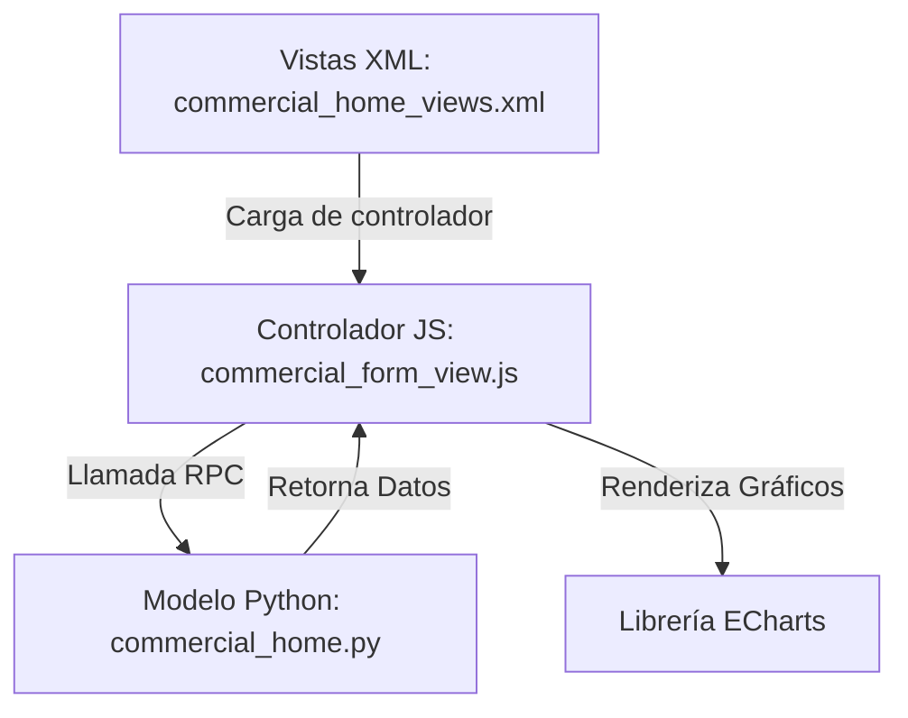

# Documentación del Dashboard: (ZRN) Manejo Comercial

Esta documentación detalla los cambios implementados para replicar el layout de **(ZRN) Planeacion** en el menú de inicio de **(ZRN) Manejo Comercial**, incorporando gráficos dinámicos interactivos mediante la librería **ECharts**.

---

## 1. Arquitectura General

El dashboard funciona combinando componentes del backend y frontend de Odoo:



### Componentes Involucrados:
1. **Backend (`commercial_home.py`)**: Calcula las métricas generales del módulo (Quickstats) y selecciona los 7 registros más recientes para mostrar en las tablas del inicio. También expone el método RPC `get_home_chart_payload` para agrupar datos requeridos por las gráficas.
2. **Frontend View & Controller (`commercial_form_view.js`)**: Controlador Owl (`ZrnCommercialHomeController`) que extiende de `FormController` y se registra bajo el nombre técnico `zrn_commercial_home`. Maneja la inicialización de ECharts, la interactividad de botones (tipo de gráfica Barras/Líneas/Pie), el ciclo de vida del DOM y la responsividad frente al redimensionamiento de pantalla.
3. **Estructura XML (`commercial_home_views.xml`)**: Define el layout HTML que estructura la barra de herramientas, quickstats y los 4 paneles principales de Prospectos, Oportunidades, Marcas y Canales en un contenedor split (tabla a la izquierda y gráfica a la derecha).

---

## 2. Detalles del Diseño de Interfaz (UI/UX)

Siguiendo las reglas de **Odoo Community** y las pautas en `AGENTS.md`:
* **Estilo Sobrio y Compacto**: Se prescindió de degradados y cards innecesarias. Se reutilizaron los estilos estandarizados de `zrn_planning` (como `zrn_planning_home_shell`, `zrn_planning_home_panel`, `zrn_planning_home_panel_split`).
* **Responsivo e Integrado**: Las tablas ocupan el 50% izquierdo del panel (`zrn_planning_plans_list_container`) y el contenedor de la gráfica ocupa el 50% derecho. Si el tamaño de la pantalla disminuye, el diseño se adapta de forma responsive.
* **Prefijo Seguro**: Todas las referencias y selectores CSS/JS propios de este módulo se estructuraron utilizando el prefijo `zrn_commercial_` para no generar colisiones de clases en el backend unificado.

---

## 3. Configuración y Control de Gráficas (ECharts)

Para no sobrecargar de assets innecesarios el sistema, se utilizó la librería de ECharts ya provista por el módulo analítico común (`zrn_analitics`):
* Ruta del recurso: `'zrn_analitics/static/lib/echarts/echarts.min.js'`

### Atributos en el HTML (XML) para la integración con JS:
En el XML se definen los siguientes selectores que utiliza el controlador:
* `data-zrn-commercial-chart="[key]"`: Indica el contenedor canvas donde ECharts dibuja el gráfico.
* `data-zrn-commercial-chart-empty="[key]"`: Contenedor con mensaje de estado vacío (cuando no existen datos para graficar).
* `data-chart-key="[key]"`: Identifica el conjunto de botones de tipo de gráfica correspondientes al panel.
* `data-zrn-chart-type="[bar|line|pie]"`: Define el tipo de gráfico a renderizar.

---

## 4. Estructura de Datos (Payload)

El método `get_home_chart_payload` del backend retorna una estructura JSON compatible con el cargador dinámico del frontend:

```python
{
    'prospects': {
        'labels': ['Nuevo', 'Calificado', 'Propuesta'],
        'values': [5, 12, 3],
        'series_label': 'Prospectos'
    },
    # Para marcas/canales (Multi-serie)
    'brands': {
        'labels': ['Marca A', 'Marca B'],
        'series': [
            {'name': 'Oportunidades', 'data': [10, 4]},
            {'name': 'Cotizaciones', 'data': [5, 8]}
        ]
    }
}
```

---

## 5. Mantenimiento y Buenas Prácticas

Cuando se agreguen nuevos paneles o campos al Dashboard, recordar:
1. Declarar los campos `compute` requeridos en `commercial_home.py` y agregarlos en la vista XML como invisibles para que estén cargados en el estado del registro (`this.model.root.resId`).
2. Si se agrega una nueva gráfica, actualizar la constante `CHART_KEYS` en `commercial_form_view.js` para que el controlador asocie automáticamente su ciclo de vida y eventos de redimensionado.
